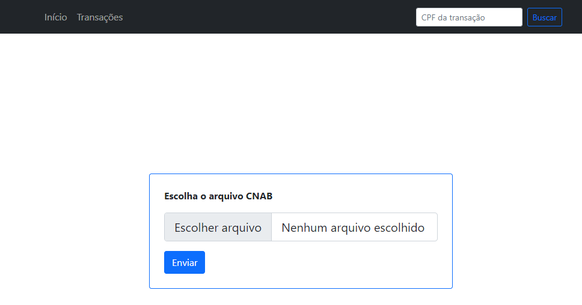
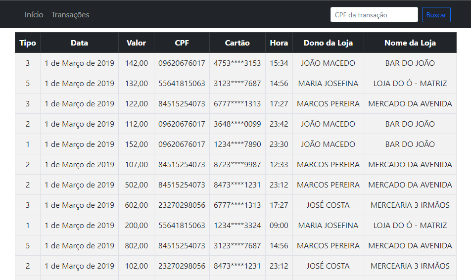

# Analizador CNAB

Una aplicación web de Django que analiza archivos CNAB. Esta aplicación le permite subir un archivo .txt en formato CNAB, extraer los datos de las transacciones y almacenarlos en una base de datos. Los datos de la transacción luego se pueden ver y buscar a través de una interfaz de usuario amigable.

## Stack de tecnología
- Python 3.x
- Django 3.x
- Django Rest Framework
- SQLite3
- Bootstrap 5

## Características

- Cargar archivo CNAB
- Extraer datos de transacciones
- Mostrar detalles de transacción
- Transacciones por ID ruta: `transaction/<int:id>/`
- Búsqueda de transacciones por CPF
- Validación de tipo de archivo

## Instalación
- Clone el repositorio: git clone `https://github.com/gabrieuz/cnab-parser.git`
- Instale los requisitos: `pip install -r requirements.txt`
- Ejecute las migraciones: `python manage.py migrate`
- Ejecute el servidor de desarrollo: `python manage.py runserver`
- Acceda a la aplicación en `http://localhost:8000`

## Uso
- Vaya a la página principal y haga clic en el botón "Escolher arquivo".
- Elija un archivo CNAB para cargar (CNAB_Example.txt está disponible como ejemplo).
- Los datos de las transacciones se extraerán y se mostrarán en una tabla.
- Use la barra de búsqueda en la barra de navegación para buscar transacciones por CPF.

## Previsualización de la interfaz

## Contribución
Este es un proyecto de código abierto y se aceptan contribuciones. Si tienes alguna idea o sugerencia, no dudes en crear una solicitud de extracción.
