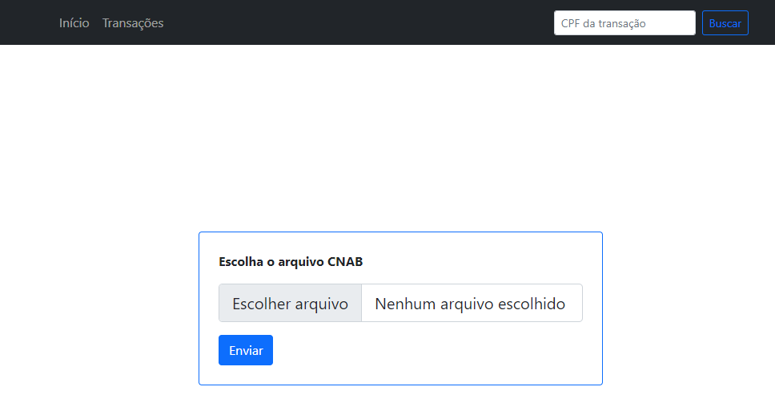
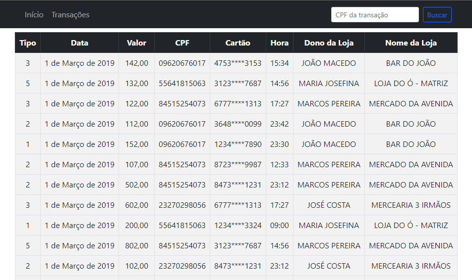

# CNAB Parser

A Django web application that parses a CNAB files. This application allows you to upload a .txt file in CNAB format, extract the transactions data, and store it in a database. The transaction data can then be viewed, searched through a user-friendly web interface.

## Technology Stack
- Python 3.x
- Django 3.x
- Django Rest Framework
- SQLite3
- Bootstrap 5

## Features

- Upload CNAB file
- Extract transactions data
- Show transaction details
- Transactions by ID route: `transaction/<int:id>/`
- Search transactions by CPF

## Installation
- Clone the repository: git clone `https://github.com/gabrieuz/cnab-parser.git`
- Install the requirements: `pip install -r requirements.txt`
- Run migrations: `python manage.py migrate`
- Run the development server: `python manage.py runserver`
- Access the application at `http://localhost:8000`

## Usage
- Go to the homepage and click on the "Escolher arquivo" button.
- Choose a CNAB file to upload (CNAB_Example.txt is available as an example).
- The transactions data will be extracted and displayed in a table.
- Use the search bar in the navbar to search for transactions by CPF.

## Contributing
This is an open-source project, and contributions are welcome. If you have any ideas or suggestions, feel free to create a pull request.

## Interface Previews

